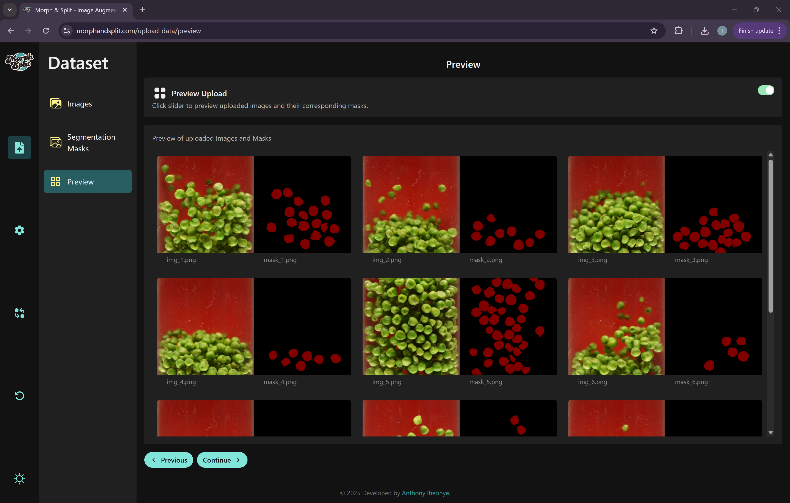
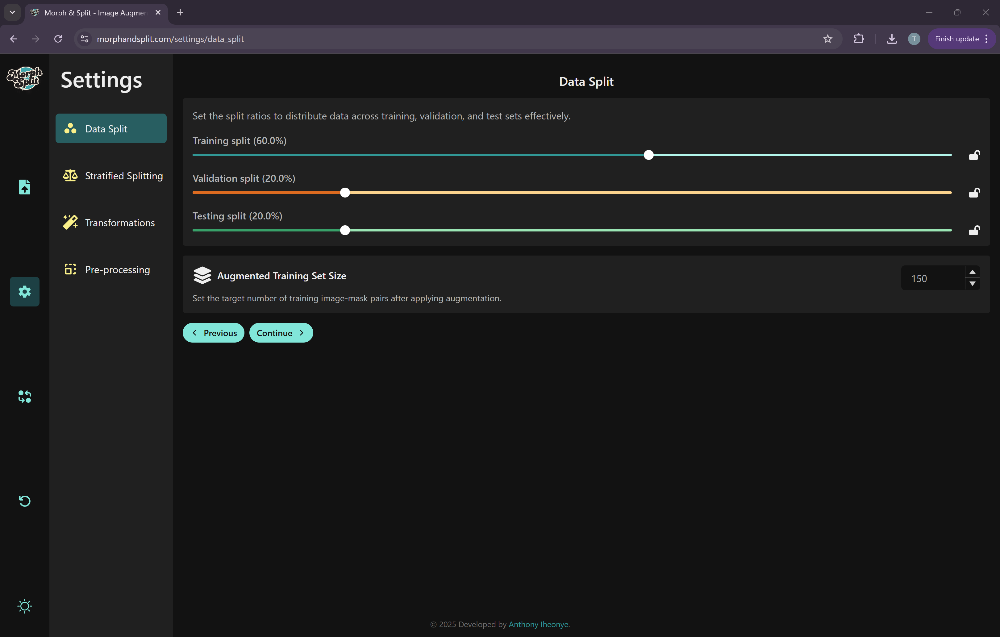
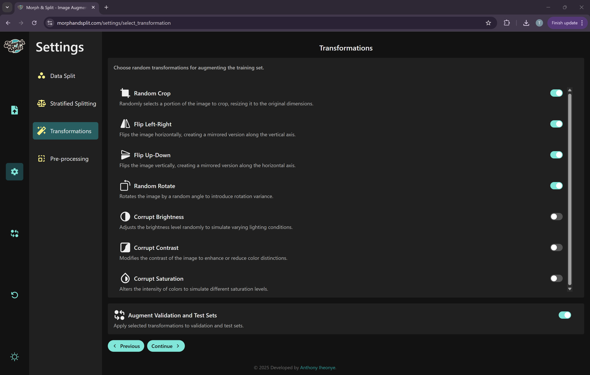
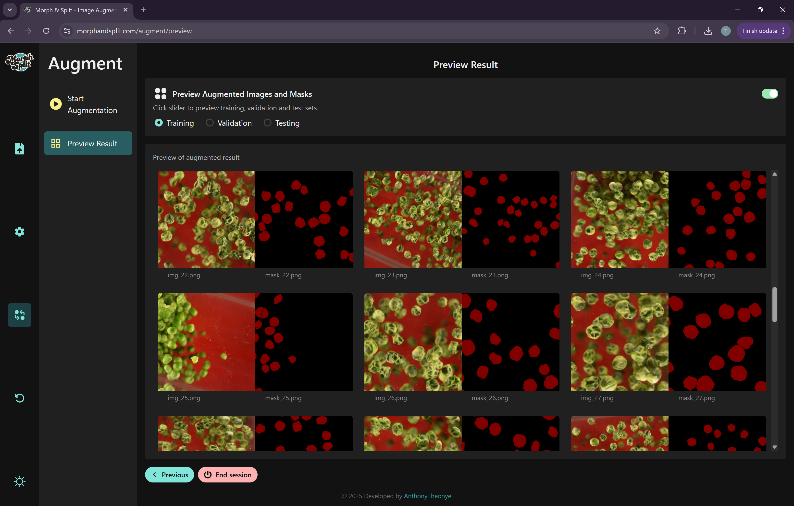
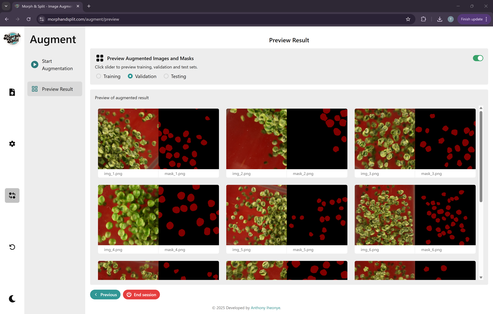

# Morph and Split

Live App: [https://www.morphandsplit.com](https://www.morphandsplit.com)

**[Morph and Split](https://www.morphandsplit.com)** is a user-friendly tool for computer vision and machine learning practitioners
to preprocess, augment, and split image-mask datasets into training, validation, and test sets.
It supports both stratified and non-stratified splitting workflows, to maintain class balance across
training, validation and test sets.

- **Frontend**: Hosted on [Vercel](https://vercel.com) or runnable locally
- **Backend**: Deployable on Google Cloud Run or runnable locally
- **Storage**: Uses Google Cloud Storage (GCS) buckets.

---

## Table of Contents

- [Morph and Split](#morph-and-split)
  - [Table of Contents](#table-of-contents)
  - [Screen Shots](#screen-shots)
  - [Project Structure](#project-structure)
  - [Technology Stack](#technology-stack)
    - [Frontend](#frontend)
    - [Backend](#backend)
    - [DevOps / Tooling](#devops--tooling)
  - [Security and Authentication](#security-and-authentication)
    - [Capabilities](#capabilities)
  - [Setup and installation](#setup-and-installation)
  - [Reference Table](#reference-table)
  - [**Development Setup**](#development-setup)
    - [Prerequisites](#prerequisites)
    - [1. Clone the repository](#1-clone-the-repository)
    - [2. Set up backend](#2-set-up-backend)
    - [3. Set up Google Cloud Authentication (WIF + SA Impersonation)](#3-set-up-google-cloud-authentication-wif--sa-impersonation)
  - [Running the Backend](#running-the-backend)
    - [Locally](#locally)
    - [On Google Cloud Run](#on-google-cloud-run)
  - [Frontend Setup](#frontend-setup)
    - [1. Navigate to the frontend folder](#1-navigate-to-the-frontend-folder)
    - [2. Install Node + npm dependencies](#2-install-node--npm-dependencies)
    - [c. Configure base URL](#c-configure-base-url)
    - [d. Run the frontend](#d-run-the-frontend)
  - [Cloud Run Deployment](#cloud-run-deployment)
    - [1. Create Docker image](#1-create-docker-image)
    - [2. Push the image to Docker Hub](#2-push-the-image-to-docker-hub)
    - [3. Deploy service to Cloud Run](#3-deploy-service-to-cloud-run)
    - [Explanation of flags](#explanation-of-flags)
    - [Get the Service URL](#get-the-service-url)
  - [You are all Set!](#you-are-all-set)
  - [License](#license)
  - [Author](#author)

---

## Screen Shots











---

## Project Structure

```text
.
├── backend
│   ├── app
│   │   ├── config
│   │   ├── __init__.py
│   │   ├── routes
│   │   ├── services
│   │   └── utils
│   ├── cors.json
│   ├── Dockerfile
│   ├── morph-and-split-toolkit-key.json
│   ├── requirements.txt
│   └── requirements_with_gpu.txt
├── docker-compose.yml
├── frontend
│   ├── Dockerfile
│   ├── eslint.config.js
│   ├── index.html
│   ├── package.json
│   ├── package-lock.json
│   ├── public
│   │   ├── assets
│   │   └── vite.svg
│   ├── src
│   │   ├── assets
│   │   ├── components
│   │   ├── entities
│   │   ├── hooks
│   │   ├── index.css
│   │   ├── main.tsx
│   │   ├── pages
│   │   ├── routes.tsx
│   │   ├── services
│   │   ├── store
│   │   ├── theme.ts
│   │   └── vite-env.d.ts
│   ├── tsconfig.app.json
│   ├── tsconfig.app.tsbuildinfo
│   ├── tsconfig.json
│   ├── tsconfig.node.json
│   ├── tsconfig.node.tsbuildinfo
│   ├── vercel.json
│   └── vite.config.ts
├── gc_authentication_setup.md
├── project_structure.txt
├── README.md
└── screenshots
```

---

## Technology Stack

Morph and Split is built with a modern, cloud-friendly stack for performance, scalability, and ease of use.

### Frontend

- **React** (TypeScript) – Interactive, component-based UI
- **Vite** – Fast bundler and dev server
- **Chakra UI** – Modular and accessible UI components
- **Zustand** – Lightweight state management
- **React Router** – Client-side routing
- **React Query** – Server-state management and caching
- **Axios** – HTTP client for API requests
- **CSS** – Custom styling and Chakra UI overrides
- **Vercel** – Hosting and deployment of the frontend

### Backend

- **Python 3.10+**
- **Flask** – Lightweight backend framework
- **TensorFlow** – Powering the image augmentation pipeline
- **scikit-image** – Advanced image processing tools
- **Google Cloud Storage (GCS)** – Storage for images, masks, and augmented data
- **Google Secret Manager** – Securely manages secrets (e.g., for signed URL key)
- **Google Cloud Run** – Serverless backend deployment
- **Workload Identity Federation (WIF)** – Secure local-to-cloud authentication
- **Service Account Impersonation** – Enables secure GCP resource access via Gmail identity
- **Docker** – Backend containerization for reproducibility and deployment

### DevOps / Tooling

- **Git** – Version control
- **Google Cloud SDK (gcloud CLI)** – Infrastructure and service configuration
- **Docker Hub** – Hosting backend container images

---

## Security and Authentication

Morph and Split uses Workload Identity Federation (WIF) and Service Account Impersonation to securely access
Google Cloud Storage and Secret Manager from both local development environments and the deployed backend on
Cloud Run. This means:

- No hardcoded credentials
- No need to download service account key files

Instead, when running locally, your Gmail identity impersonates the service account using WIF.
When running on Google Cloud Run, the service account directly authenticates and accesses resources securely.

### Capabilities

Whether locally or in production, the backend can:

- Create and delete buckets
- Upload/download/delete files in GCS
- Generate signed URLs for uploads and downloads
- Access secrets securely from Secret Manager

---

## Setup and installation

You can run Morph and Split with:

- Backend on your local machine or deployed to Google Cloud Run
- Frontend on Vercel or your local machine
- Data stored in your Google Cloud Storage buckets

To enable this, you will need to set up:

- A Google cloud account
- A Google cloud project
- A Service Account
- Workload Identity Federation, and
- Service Account Impersonation

We will use the GCloud CLI for most of the setup.

## Reference Table

Here is a placeholder reference table:

| #   | Item                            | Placeholder                          | Example                  |
| --- | ------------------------------- | ------------------------------------ | ------------------------ |
| 1   | Gmail Address                   | YOUR_GMAIL_ADDRESS                   | aiheonye@gmail.com       |
| 2   | Project ID                      | YOUR_PROJECT_NAME                    | morph-and-split-app      |
| 3   | Service Account Name            | YOUR_SERVICE_ACCOUNT_NAME            | morph-and-split-app-sa   |
| 4   | Workload Identity Pool Name     | YOUR_WORKLOAD_IDENTITY_POOL_NAME     | morph-and-split-wif      |
| 5   | Workload Identity Provider Name | YOUR_WORKLOAD_IDENTITY_PROVIDER_NAME | morph-and-split-provider |

---

## **Development Setup**

### Prerequisites

- Python 3.10+
- Node.js 20.15+
- npm 10.7.0+
- Google Cloud SDK (gcloud)
- Docker

### 1. Clone the repository

First, clone the Morph and Split repo to your local machine:

```bash
git clone https://github.com/anthony-iheonye/morph-and-split.git
cd morph-and-split
```

### 2. Set up backend

```bash
cd backend
python3 -m venv ms_venv           # create a virtual environment, ms_venv.
source ms_venv/bin/activate       # activate the ms_venv
pip install --upgrade pip         # upgrade pip
pip install -r requirements.txt   # Install dependencies
```

### 3. Set up Google Cloud Authentication (WIF + SA Impersonation)

This includes steps like:

- Activating your Google Cloud account
- Installing gcloud
- Creating a project, billing, and enabling APIs
- Creating and assigning roles to a service account
- Setting up Workload Identity Federation
- Generating the WIF key JSON file
- Updating the Python config class

All the steps are documented [here](./gc_authentication_setup.md#setting-up-google-cloud-authentication)

---

## Running the Backend

### Locally

```bash
flask run
```

The backend will start on: http://127.0.0.1:5000

### On Google Cloud Run

See [Cloud Run Deployment](#cloud-run-deployment) section to:

- Build and push Docker image
- Deploy to Cloud Run
- Retrieve the public service URL

---

## Frontend Setup

### 1. Navigate to the frontend folder

```bash
cd ../frontend
```

### 2. Install Node + npm dependencies

```bash
npm install
```

### c. Configure base URL

Edit the `baseURL` in the frontend config file `frontend/src/services/api-client.ts`

```bash
export const baseURL = "http://127.0.0.1:5000";         # local
// or use Cloud Run URL if deploying
```

### d. Run the frontend

```bash
npm run dev
```

Your app should now be accessible on http://localhost:5173

---

## Cloud Run Deployment

To run the backend on Cloud Run, you’ll first need to build a Docker image of the backend,
push it to Docker Hub, and then use the image URL to deploy a Cloud Run service.

### 1. Create Docker image

```bash
docker build -t anthonyiheonye/morph_and_split-backend:12 .
```

### 2. Push the image to Docker Hub

```bash
❯ docker push anthonyiheonye/morph_and_split-backend:12
```

### 3. Deploy service to Cloud Run

Let’s say we want to deploy a service called `morph-and-split-backend` using your container
image hosted on Docker Hub. Below are the deployment details:

- **Project**: `morph-and-split-toolkit`
- **Service name**: `morph-and-split-backend`
- **Container image**: `docker.io/anthonyiheonye/morph_and_split-backend:12`
- **Service account** : `morph-and-split-toolkit-sa`, which will be used for authentication and permissions
- **Region**: `us-central1` (where the service will be deployed)
- **Port**: `5000`, the port on which the app inside the container listens
- **Resources**: 32 GiB of memory, 8 CPUs, and CPU boost enabled for faster startup
- **Scaling**: Minimum 1 instance, up to 30 instances, with up to 1000 concurrent requests per instance
- **Timeout**: 30 minutes (1800 seconds) for long-running tasks
- **Secrets**: The secret `GCS_SIGNED_URL_KEY` is injected into the container as an environment variable
- **Access**: `--allow-unauthenticated` means the service is publicly accessible
- **Quiet Mode** `--quiet` disables prompts during deployment for smoother automation

```bash
gcloud run deploy morph-and-split-backend \
  --project=morph-and-split-toolkit \
  --image=docker.io/anthonyiheonye/morph_and_split-backend:12 \
  --service-account=morph-and-split-toolkit-sa@morph-and-split-toolkit.iam.gserviceaccount.com \
  --region=us-central1 \
  --port=5000 \
  --memory=32Gi \
  --cpu=8 \
  --timeout=1800 \
  --concurrency=1000 \
  --min-instances=1 \
  --max-instances=30 \
  --cpu-boost \
  --execution-environment=gen1 \
  --set-secrets=GCS_SIGNED_URL_KEY=GCS_SIGNED_URL_KEY:latest \
  --allow-unauthenticated \
  --quiet
```

### Explanation of flags

| Flag                                  | Purpose                                                    |
| ------------------------------------- | ---------------------------------------------------------- |
| `--project`                           | Your GCP project name                                      |
| `--image`                             | Docker container image from Docker Hub                     |
| `--service-account`                   | Cloud Run will use this SA to run the container            |
| `--port`                              | Port your app listens on inside the container              |
| `--memory`                            | Allocates 32GiB RAM per container instance                 |
| `--cpu`                               | Allocates 8 vCPUs per instance                             |
| `--timeout`                           | Sets request timeout to 1800 seconds                       |
| `--concurrency`                       | Allows up to 1000 concurrent requests per instance         |
| `--min-instances` / `--max-instances` | Controls autoscaling range                                 |
| `--cpu-boost`                         | Ensures startup CPU boost is enabled                       |
| `--execution-environment=gen1`        | Default execution environment (or use `gen2` if preferred) |
| `--set-secrets`                       | Injects Secret Manager secret into environment variable    |
| `--allow-unauthenticated`             | Makes the service public (remove if not needed)            |
| `--quiet`                             | Suppresses prompts                                         |

### Get the Service URL

After deployment, you will receive an output like this:

```text
Deploying container to Cloud Run service [morph-and-split-backend] in project [morph-and-split-toolkit] region [us-central1]
✓ Deploying...
✓ Creating Revision...
Service [morph-and-split-backend] revision [morph-and-split-backend-xxxxx] has been deployed and is serving 100 percent of traffic.
Service URL: https://morph-and-split-backend-xxxxx-uc.a.run.app
```

Copy the service URL (the last line). Then, go to:

```bash
frontend/src/services/api-client.ts
```

And update the baseUrl variable with your new Cloud Run URL. Save the file — and just like that,
your frontend will start communicating with your deployed backend on Cloud Run.

---

## You are all Set!

You’re now ready to run Morph and Split locally or via Cloud Run. Happy Augmenting!

---

## License

This project is licensed under the MIT License.

---

## Author

Developed by [Anthony Iheonye](https://github.com/anthony-iheonye) | [LinkedIn](https://www.linkedin.com/in/anthony-iheonye/)
